# Modding changes and improvements

This is a non-exhaustive list of changes modders may want to be aware of.

## Removed behavior

### Lighting-related

- `Tile::light` is now unused by the engine, because the lightmap is held in a separate buffer. It was kept as to not break compatibility but mods relying on this field will misbehave.
- `CMap::getColorLight` is now only affected by map lighting and not by blob lights. This is due to how the lighting now works. If you required this behavior, you may need to emulate it.

## Deprecated behavior

Some behavior has been deprecated but kept functional in order to maintain compatibility with existing scripts.

Two `autoconfig.cfg` variables have been added:

- `g_allowdeprecated` (defaulting to `true`) allows deprecated behavior to function. If disabled, relying on deprecated behavior will cause an error, so the script may fail to compile or encounter an exception, whichever is relevant.
- `g_warndeprecated` (defaulting to `false`) will warn when relying on deprecated behavior. This is useful in order to identify and fix reliance on deprecated behavior in your mods.

Here is a list of the following deprecated behaviors.

### `.length()` calls

```angelscript
const int[] my_ints = {1, 2, 3};

const int len1 = my_ints.length(); // DEPRECATED!
const int len2 = my_ints.length; // OK
const int len3 = my_ints.size(); // OK
```

Use `.length` or `.size()` instead of `.length` (both are functionally equivalent).

The reason for this is that `.length` is already registered and used using [property accessors](https://www.angelcode.com/angelscript/sdk/docs/manual/doc_reg_objprop.html) when the latest AngelScript version does not allow to have a method and a proprety with the same name.

The workaround consists of replacing **any identified** `.length()` calls to `.size()`.  
This works for all tested mods, but this may cause issues should you be calling any `.length()` method on your script classes.

If `g_allowdeprecated` is set to **`false`**, this will skip the script preprocessing and will cause the script to fail to compile.

### Out-of-bounds array accesses

Certain array types would silently allow indexing outside of array boundaries, which could allow mods to read garbage data or cause hard crashes.

- If `g_allowdeprecated` is set to `true`, any out-of-bounds access will return the last element of the array, if present, or cause a script exception otherwise.
- If `g_allowdeprecated` is set to `false`, any out-of-bounds access will cause a script exception as it should.

## New standard script bindings

- `weakref<>` was added and is now usable for all script types, plus `CBlob@` and `CParticle@` for the time being. This is strongly recommended when keeping long-lasting references to such objects.

## Updated AngelScript

AngelScript has been updated to a recent version. This brings among other things faster script compilation and new language features, including `auto`, `final`, anonymous functions, list initializers, among other things.

## AngelScript JIT

A [new JIT compiler](https://github.com/asumagic/angelsea) is used to improve script performance, especially for loop- and call-heavy code.

Script annotations were added to alter the JIT compiler behavior. At present, the following metadata entries are available for functions:

- `[jit::disable_jit]`: Disable JIT compilation for this function. Only use for troubleshooting.
- `[jit::ignore_perf_warnings]`: Inhibit the warning that occurs when the JIT compiler encounters a function that is too complex to compile.

Example:

```angelscript
[jit::ignore_perf_warnings]
void addCommonBuilderBlocks(BuildBlock[][]@ blocks, int team_num = 0, const string&in gamemode_override = "")
{
...
```

## Shader support

`Render::CompileShader` was added, which allows you to assign a shader to a specific `SMaterial` (or `Render2D::SimpleMaterial`, as described later), which overrides its material type.

Here is an example that assigns a shader to a player blob.

`test.frag`:

```glsl
#version 130

uniform sampler2D tex0;
uniform float time;

void main() 
{
    vec4 color = texture2D(tex0,  gl_TexCoord[0].xy);
    if (color.a < 0.01) { discard; }
    gl_FragColor.rgba = color * 1.2;
    gl_FragColor.r *= (sin(time * 0.5) + 1.0) * 0.5 + sin(gl_FragCoord.x / 4.0 + time);
    gl_FragColor.g *= (sin(time * 0.5) + 1.0) * 1.0 + sin(gl_FragCoord.y / 4.0 + time);
}
```

`test.vert`:

```glsl
#version 130

uniform float time;

void main()
{
    vec4 pos = vec4(
        gl_Vertex.x + sin(time * 0.3) * 6,
        gl_Vertex.y + sin(time * 0.5) * 2,
        gl_Vertex.zw
    );
    gl_Position = gl_ModelViewProjectionMatrix * pos;
    gl_TexCoord[0] = gl_MultiTexCoord0;
}
```

Then paste in the console:

```angelscript
Render::Shader@ shader = Render::CompileShader(
    "test.vert", "test.frag",
    SMaterial::MType::TRANSPARENT_ALPHA_CHANNEL,
    function(Render::Uniforms &in vert, Render::Uniforms &in frag, any@) {
        float t = getGameTime() + getInterpolationFactor();
        vert.SetFloat("time", t);
        frag.SetFloat("time", t);
    });
CSprite@ sprite = @getLocalPlayerBlob().getSprite();
sprite.material.SetShader(@shader);
```

Your character should now be extra disco.

Assigning a shader to a `SMaterial` is equally easy. For example, this modifies the terrain shaders from KAGCraft2 to make terrain move wavily and make colors pass over it:

```angelscript
Render::Shader@ shader = Render::CompileShader(
	"terrain.vert",
	"terrain.frag",
	SMaterial::TRANSPARENT_ALPHA_CHANNEL_REF,
	function(Render::Uniforms &in vert, Render::Uniforms &in frag, any@) {
		vert.SetFloat("time", getGameTime() + getInterpolationFactor());
		frag.SetFloat("time", getGameTime() + getInterpolationFactor());
	}
);
map_material.SetShader(@shader);
```

Where `terrain.frag` is:

```glsl
#version 130

uniform sampler2D tex0;
uniform float time;

in vec3 basePos;

// hsv routines yoinked from https://stackoverflow.com/a/17897228/6261331
// under wtfpl license

vec3 rgb2hsv(vec3 c)
{
    vec4 K = vec4(0.0, -1.0 / 3.0, 2.0 / 3.0, -1.0);
    vec4 p = mix(vec4(c.bg, K.wz), vec4(c.gb, K.xy), step(c.b, c.g));
    vec4 q = mix(vec4(p.xyw, c.r), vec4(c.r, p.yzx), step(p.x, c.r));

    float d = q.x - min(q.w, q.y);
    float e = 1.0e-10;
    return vec3(abs(q.z + (q.w - q.y) / (6.0 * d + e)), d / (q.x + e), q.x);
}

vec3 hsv2rgb(vec3 c)
{
    vec4 K = vec4(1.0, 2.0 / 3.0, 1.0 / 3.0, 3.0);
    vec3 p = abs(fract(c.xxx + K.xyz) * 6.0 - K.www);
    return c.z * mix(K.xxx, clamp(p - K.xxx, 0.0, 1.0), c.y);
}

void main() 
{
    vec4 texColor = texture2D(tex0, gl_TexCoord[0].xy);
    if (texColor.a < 0.01) { discard; }

    vec3 hsv = rgb2hsv(texColor.rgb);
    /* h */ hsv.r *= 1.0 + sin(basePos.y * 0.5 + basePos.z * 0.2) + sin(basePos.x * 0.1 + time * 0.1) * 0.4;
    /* s */ hsv.g += sin(basePos.y * 0.15 + time * 0.2) * 0.3;
    /* v */ hsv.b += sin(basePos.z * 0.1 + time * 0.2) * 0.05;

    vec4 color = vec4(hsv2rgb(hsv), texColor.a);

    gl_FragColor = color;
}
```

And `terrain.vert` is:

```glsl
#version 130

uniform float time;

out vec3 basePos;

void main()
{
    basePos = gl_Vertex.xyz;

    vec4 pos = vec4(
        gl_Vertex.x + sin(gl_Vertex.y + time * 0.4) * 0.5 + sin(gl_Vertex.z * 0.1 + time * 0.02) * 3,
        gl_Vertex.y + sin(gl_Vertex.z * 0.1 + time * 0.1) * 4.0,
        gl_Vertex.z + sin(gl_Vertex.x + time * 0.3) * 0.5 + sin(gl_Vertex.x * 0.1 + time * 0.02) * 3,
        gl_Vertex.w
    );

    gl_Position = gl_ModelViewProjectionMatrix * pos;
    gl_TexCoord[0] = gl_MultiTexCoord0;
}
```

This results in:

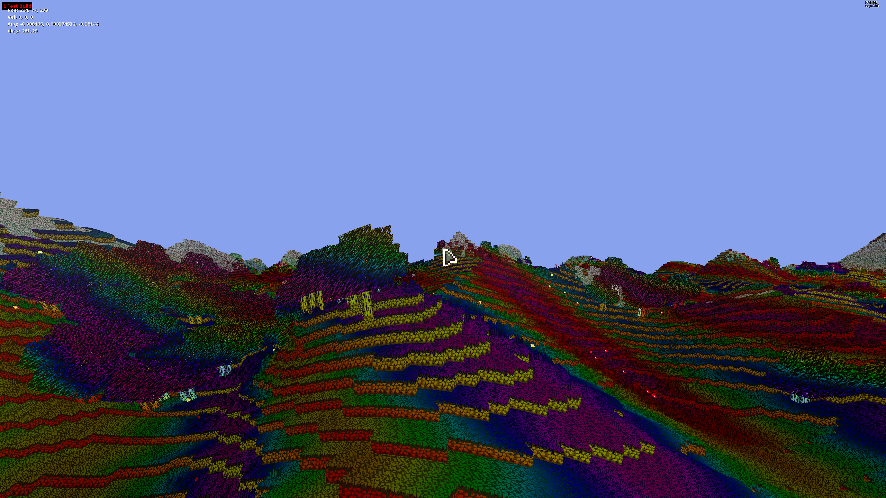

`SMaterial` supports up to 4 samplers (textures). All these 4 textures are available as `tex0`, `tex1`, `tex2` and `tex3`.

## Rendering API

The internal rendering logic was overhauled, mainly featuring a batching immediate-mode rendering pipeline, `Render2D`.
The gist of it is that now, most rendering is queued in a new internal system instead of emitting draw calls immediately.
This allows for various improvements, including automated batching for improved performance, and "perfect" translucency sorting (whereas drawing semi-transparent things was impossible to achieve accurately before).

There exists two internal render targets exposed to scripts:

- `Render2D::Shape2D::RenderForWorld`, which uses worldspace coordinates and allows you to select a specific Z for your shape to be rendered
- `Render2D::Shape2D::RenderForGUI`, which uses screenspace coordinates and which behaves as if every new call renders on top of the previous

In order to obtain a shape, there are two classes using the builder pattern you can use:

- `Render2D::CustomShape2D`: Raw-ish API that lets you pass a material, a vertex array and an index array.
- `Render2D::Image2D`: Simple API appropriate for rendering sprites or icons without custom rendering.

These rendering routines should be called from either an `onRender` hook, or from a `Render::` script (if appropriate).

In both cases, you then trigger rendering through the `.shape` attribute. Here is an example that draws the `default.png` texture stretched to 128x128, in screenspace, with a (16, 16) origin:

```angelscript
Render2D::Image2D("default.png")
	.DestinationRect(16, 16, 128+16, 128+16)
	.shape
	.RenderForGUI();
```

`Render2D::Image2D` is rather simple and does not allow for more complex transforms. You can customize the mesh and material using `Render2D::CustomShape2D`, maybe wrapping it yourself in a class if you want to implement your own basic image transforms.

Another example which renders a white triangle (with the default material) at the top-left of the map at depth 10000 (higher is closer to camera, so it is in front of most things, including the black border):

```angelscript
Render2D::CustomShape2D(
	Render2D::SimpleMaterial(),
	{
		Vertex(-128, 0, 0, 0, 0),
		Vertex(128, 0, 0, 0, 0),
		Vertex(0, 128, 0, 0, 0)
	},
	{0, 1, 2}
).shape.RenderForWorld(10000.0f, Render2D::ZSetMode::OverrideVertexZ);
```

Note that `Render2D::SimpleMaterial` supports scripted textures, and as such so does `Render2D::Image2D`.

You may be wondering why this uses a new material class instead of using `SMaterial`. The gist of it is that `SimpleMaterial` was intentiontally kept as simple as possible to make it cheap and simple to manage internally, in a way that enables fast batching.

It is possible to assign a shader to a `Render2D::SimpleMaterial`, but with the following limitations:

- You will only be able to use one sampler (texture), e.g. the texture of the sprite itself if changing the material of a sprite layer.
- `gl_VertexID` cannot be relied upon in the vertex shader, because batching aggregates primitives in the vertex buffer in an unpredictable order.
- If you want different instances of the same sprite with the same shader to have different uniforms associated, you can do so by setting the `uint16 uniqueKey`. The uniform callback will be called once for every `uniqueKey` in use. You can then inspect it by getting the material being rendered with `Render2D::GetActiveMaterial()` (**only** inside the uniforms callback). Bear in mind this will split batches, so only do it if you really can't share all uniforms. This is not needed when using `Render::SMaterial`, because then draws are not batched whatsoever.

Here is how the last point would look like with the disco shader example:

```angelscript
Render::Shader@ shader = Render::CompileShader(
    "test.vert", "test.frag",
    SMaterial::MType::TRANSPARENT_ALPHA_CHANNEL,
    function(Render::Uniforms &in vert, Render::Uniforms &in frag, any@) {
        float t = getGameTime() + getInterpolationFactor();
        vert.SetFloat("time", t);
        frag.SetFloat("time", t);

        /* demo of unique keys */
        Render2D::SimpleMaterial mat;
        Render2D::GetActiveMaterial(mat);
        print('' + mat.uniqueKey);
    });
CSprite@ sprite = @getLocalPlayerBlob().getSprite();
sprite.material.uniqueKey = 123;
sprite.material.SetShader(@shader);
```

Notice how on every frame, this prints the unique key associated with the material.

If you want to render complex meshes, you should still use the appropriate `Render::` functions. The new classes are useful for drawing a moderate amount of small 2D meshes (e.g. single quads) that are quick to copy around.

Note that Z sorting happens internally, but when using opaque shapes, it counter-intuitively happens from front-to-back.  
In other words, the engine tries to make draws that are close to the camera happen (foreground) **before** the ones that are far away from the camera (background). Z writes and tests ensure the final correct order. This is done as an optimization, to avoid unnecessary framebuffer writes.
If you use a translucent material or whatever else that isn't opaque and requires blending, you may need to call the `.shape.StrictOrdering()` method before rendering it. This reduces the effectiveness of batching and so should only be done as needed.  
Sprites with pixels that are either fully transparent or fully opaque do *not* qualify as "translucent". Strict ordering is not needed for those, because regular Z write and read logic only falls apart with translucency and complex blending.

The ordering process is not entirely seamless: Lightmap rendering causes all worldspace render calls queued so far to be flushed. This is generally not an issue for correctness, though, as little stuff is rendered worldspace afterwards.

You can now also request the Render2D API to call back a function (optionally forwarding some `any@` data for your convenience) for custom worldspace or GUI rendering, from which you would usually call `Render::` functions.

```angelscript
AddWorldRender(-100.0f, function(any@) { print("hello!"); });
```

```angelscript
AddGUIRender(function(float z, any@) { print("i should render at depth " + z); });
```

Note that the worldspace routines don't yet support strict ordering. Thus, your function will be called back during the front-to-back rendering stage.  
This is only a problem if you are trying to render translucent/blending meshes. In that case, the current workaround is to perform rendering in a render script and ensure that your Z tests and writes are set up appropriately.

## Font rendering

Most font rendering can now be replaced by using `GUI::BannerBuilder`. It provides a unique interface for rendering text either via `CBanner` (implicitly) or via regular text rendering.

Example from `BuilderInventory.as` which (implicitly) relies on banners to draw a background and showing icons:

```angelscript
GUI::DrawText( getTranslatedString("Requires\n") + missingText, Vec2f(boxpos.x - 50, boxpos.y - 15.0f), Vec2f(boxpos.x + 50, boxpos.y + 15.0f), color_black, false, false, true );
```

This example can be replaced with:

```angelscript
GUI::BannerBuilder()
	.with_current_font()
	.with_text(getTranslatedString("Requires\n") + missingText)
	.with_rect(Vec2f(boxpos.x - 50, boxpos.y - 15.0f), Vec2f(boxpos.x + 50, boxpos.y + 15.0f))
	.with_color(color_black)
	.with_banner_background(true)
	.render_as_banner();
```

Another example from `HoverMessage.as`:

```angelscript
GUI::DrawText(
	t.text,
	base_offset + t.offset + Vec2f(kickout_effect, 0.0f),
	t.color
);
```

Which can be replaced with:

```angelscript
GUI::BannerBuilder()
	.with_current_font()
	.with_text(t.text)
	.with_color(t.color)
	.with_origin_as_rect(base_offset + t.offset + Vec2f(kickout_effect, 0.0f))
	.render_simple();
```

Note that `GUI::DrawText` has an implicit offset of `Vec2f(2.0f, 2.0f)` added to the position. `BannerBuilder` does not, but if you want to have this offset, you can pass `true` to `.render_simple`, i.e. `.render_simple(true)`.

The API is fairly self-descriptive, so check the interface for more details.

## Lighting

The lighting logic was entirely rewritten. Light sources are now significantly cheaper to render, and lighting updates are consistently (near-)instant and significantly less glitchy.

There are a few new modding possibilities, namely:

- Dynamic light sources are now rendered as a texture. This is much cheaper, and you can also now manipulate it via `sprite.getLightLayer()`.
- Particles can now be added to the light layer! This allows you to make fairly cheap lighting effects, such as soft explosion flashes.
- You can control some aspects of shadowmap rendering (i.e. tile lighting), e.g. for adding a minimum lighting in caves.

Some of these capabilities are showcased here: https://github.com/transhumandesign/kag-base/pull/2319/files

## Better script error logging

Script compile errors were reworked to be more readable and to provide context.

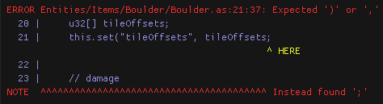

AngelScript prompt errors have been improved in a similar way:

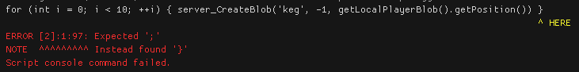

Script execution traces were also improved:

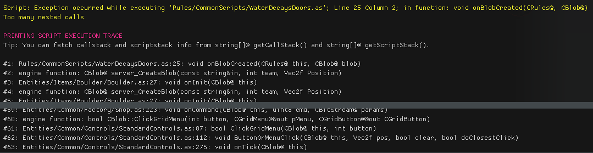

## Blob tick throttling

A `CBlob::throttleInterval` field has been added, which allows to throttle blob ticking entirely. This is much more effective than just throttling scripts using `runFlags` because it skips much more processing (including `CSprite` ticking).

This may require some testing to see if it is worthwhile for your particular usecase, but this was found to improve performance without introducing significant side-effects when used properly.

Off-screen blob throttling can be implemented by adding the `OffscreenThrottle.as` script to blobs that you want to throttle (NOTE: see the `AsuMagic/kag-base:staging-all` branch).

## Script timeout detection

`g_timeoutscripts` has been improved to be less impactful on performance. While not perfectly reliable, this can be used to detect the source of infinite loops in your scripts.

## `CBitStream` read checking

`CBitStream` now checks for bad reads more aggressively. You should still always use `saferead_` methods when possible but this should help catching some programming errors.

## New keys

The `EKEY_CODE` enum has been extended with two new sets of keys:

- `MIDI_FIRST`..`MIDI_LAST`. If a key `x` is within that range, `x - MIDI_FIRST` is the MIDI key pitch.
- `MOUSE_EXTRA_FIRST`..`MOUSE_EXTRA_LAST`. If a key `x` is within that range, `x - MOUSE_EXTRA_FIRST` is the number of the extra mouse button. For instance, `MOUSE_EXTRA_FIRST` is the 1st extra button, `MOUSE_EXTRA_FIRST + 1` is the 2nd extra button, and so on.

`KEY_XBUTTON1` and `KEY_XBUTTON2` were remapped to `MOUSE_EXTRA_FIRST` and `MOUSE_EXTRA_FIRST + 1`, respectively. This means that their underlying value has changed, but this should not be a problem if you were not relying on such behavior (by e.g. serializing the button index between uncompatible versions).

Note that key names are properly implemented for these keys, so `CControls::getKeyName()` will return a human-readable name. In particular, for MIDI keys within the range of a piano, piano key names will be used (e.g. `"MIDI KEY C#5"`).

## (EXPERIMENTAL) dear imgui bindings

Various dear imgui functions now have a binding provided in the `ImGui` namespace. Refer to the scripting manual, as usual. API usage is mostly identical to C++ interface, so the official documentation and [imgui demo](https://github.com/ocornut/imgui/blob/master/imgui_demo.cpp) should be useful.

Simple example script:

```angelscript
void onRender(CRules@ this)
{
	if (ImGui::Begin("Blobs"))
	{
		CBlob@[] blobs;
		getBlobs(@blobs);

		for (int i = 0; i < blobs.size(); ++i)
		{
			ImGui::PushID(i);

			CBlob@ blob = @blobs[i];
			ImGui::Text(blob.getName());
			ImGui::SameLine();
			ImGui::TextDisabled("netid: " + blob.getNetworkID());
			ImGui::SameLine();
			if (ImGui::Button("kill"))
			{
				blob.server_Die();
			}

			ImGui::PopID();
		}
	}

	ImGui::End();
}
```

## (EXPERIMENTAL) New audio bindings

`Sound::play` and related functions now return a `Sound::Voice@` handle. This new class provides various methods to manage a sound by e.g. adding sound effects, changing the pitch dynamically.

Several audio filters were added:

```
Sound::Filter@ Sound::CreateBassboostFilter()
Sound::Filter@ Sound::CreateBiquadResonantFilter()
Sound::Filter@ Sound::CreateDCRemovalFilter()
Sound::Filter@ Sound::CreateEchoFilter()
Sound::Filter@ Sound::CreateFlangerFilter()
Sound::Filter@ Sound::CreateFreeverbFilter()
Sound::Filter@ Sound::CreateLofiFilter()
Sound::Filter@ Sound::CreateRobotizeFilter()
Sound::Filter@ Sound::CreateWaveShaperFilter()
```

You can set a sound filter to be used globally using `Sound::setGlobalFilter()` (e.g. you could set a freeverb global filter to be used when you are in a cave to simulate reverb acoustics).

Several audio sources were added:

```
Sound::Speech@ Sound::CreateSpeech(const string&in name)
void Sound::RebindSpeech(const string&in name, Sound::Speech@ speech)
Sound::Vizsn@ Sound::CreateVizsn(const string&in name)
void Sound::RebindVizsn(const string&in name, Sound::Vizsn@ vizsn)
Sound::Noise@ Sound::CreateNoise(const string&in name)
void Sound::RebindNoise(const string&in name, Sound::Noise@ vizsn)
```

Audio sources are created by binding them to a name. This name can then be used instead of the path to a sound file in order to play audio using said audio source.  
`Sound::Rebind*` methods bind an *existing* sound source to a name if this is something you want to do.

Refer to the SoLoud documentation for further explanation (most notably on filter parameters). Note that instead of free functions, most of voice handling functions are implemented as methods.

Here is an example of chat voice synthesis implemented using the new audio and dear imgui bindings:

```angelscript
bool use_vizsn = false;

namespace params
{

uint base_frequency = 1330;
float base_speed = 10.0f;
float base_declination = 5.0f;
int waveform = Sound::SpeechWaveform::TRIANGLE;

}

bool onClientProcessChat(CRules@ this, const string &in textIn, string &out textOut, CPlayer@ player)
{
	// Sound::Source@ source = @speech or @vizsn conditionally;
	Sound::Speech@ speech = null;
	Sound::Vizsn@ vizsn = null;

	if (use_vizsn)
	{
		@vizsn = Sound::CreateVizsn("chat");
		vizsn.setText(textIn.toLower());
	}
	else
	{
		@speech = Sound::CreateSpeech("chat");
		speech.setParams(params::base_frequency, params::base_speed, params::base_declination, params::waveform);
		speech.setText(textIn.toLower());
	}

	CBlob@ blob = player.getBlob();

	Sound::Voice@ voice;

	if (blob !is null)
	{
		@voice = Sound::Play("chat", blob.getPosition());
	}
	else
	{
		@voice = Sound::Play("chat");
	}

	voice.setVolume(10.0f);

	return true;
}

void onRender(CRules@ this)
{
	if (ImGui::Begin("Speech synth"))
	{
		if (!use_vizsn)
		{
			params::base_frequency = ImGui::SliderInt("Frequency", params::base_frequency, 100, 10000);
			params::base_speed = ImGui::SliderFloat("Speed", params::base_speed, 1.0f, 100.0f);
			params::base_declination = ImGui::SliderFloat("Declination", params::base_declination, 1.0f, 50.0f);
			params::waveform = ImGui::SliderInt("Waveform type", params::waveform, Sound::SpeechWaveform::SAW, Sound::SpeechWaveform::WARBLE);
		}
	}

	ImGui::End();
}
```

## Debug menu and new console

A new debug menu was added and can be brought up using F5, or the home key to open the console and focus on the text prompt.

The new console should be more intuitive to use and integrates with the new debug menu better.

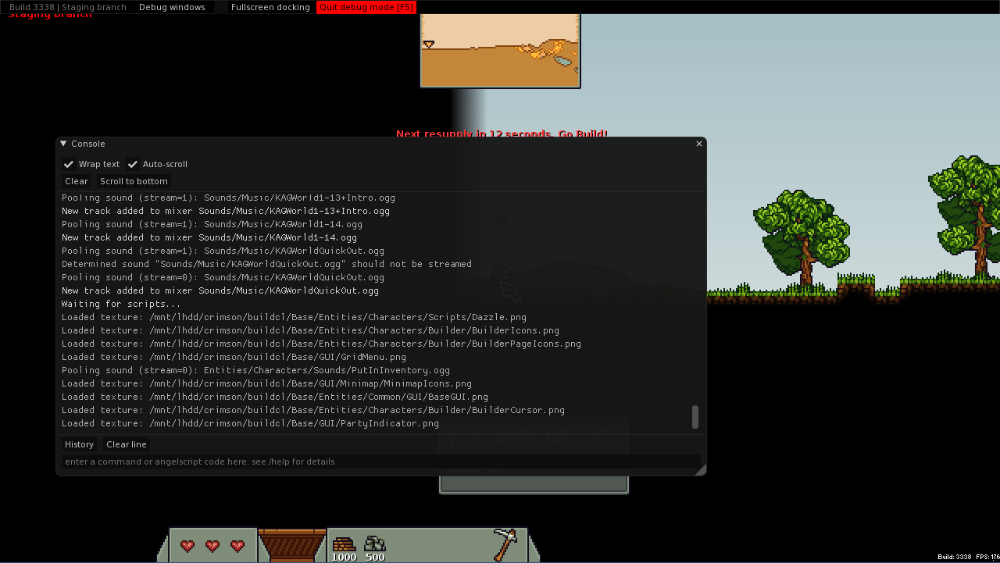

This uses the [`docking`](https://github.com/ocornut/imgui/issues/2109) branch of [dear imgui](https://github.com/ocornut/imgui), so you can dock windows together by grabbing them by the title bar. You can make a window fullscreen by ticking "Fullscreen docking" in the menu bar on top and by dragging the window you want by the titlebar.

Note that some of the debug windows will only be available if you have admin rights on the server you are playing on.

### Note on plots

There are several uses of plots in the debug menu, so here are general tips on how to use these efficiently:

- You can move around the plot by keeping left click pressed and dragging the cursor around.
- You can scroll in the plot area in order to zoom on both axes, or you can scroll on an axis to zoom that particular one.  
- You can double left click on the plot area in order to fit all points in the graph.  
- You can double right click the plot in order to open a contextual menu useful to modify some plot rendering behavior.  
- You can temporarily hide a plot by clicking its square in the legend.

### Profiler

The existing profiler was removed in favor of Tracy integration. This allows local or remote profiling of a client or server build.

Tracy integration is relatively minimal, but it highlights important subsystems of the engine and will track the execution time of individual scripts.  
KAG disables some Tracy options. Namely, it currently doesn't provide graphics profiling, sampling profiling and does not broadcast its presence over TCP (i.e. you must enter the IP manually).

First, download and install the Tracy GUI. You should match the Tracy version that we use in engine, currently **`0.12.2`**.  
You can download the official pre-built binaries for Windows here: https://github.com/wolfpld/tracy/releases/download/v0.12.2/windows-0.12.2.zip  
On Linux, clone the according tag and compile it according to documentation. The Windows pre-builts seem to work fine under Wine though, and you can still profile the Linux builds that way.

The GUI is `tracy-profiler` (`.exe`). Run it and start a connection to the default localhost settings.

Tracy is entirely disabled in KAG by default. You must pass the `profile` commandline argument to KAG on startup, e.g. `./KAG noautoupdate profile`.  
**Bear in mind this exposes a network socket.** You might not want to expose this to the internet. The `TRACY_ONLY_LOCALHOST=1` environment variable can be used to restrict listening to a local port. If you want to profile a remote client or server, you could set up a VPN like tailscale and block the `8086` TCP port from the general internet with a firewall.

### Audio

Audio debug. This is only useful for debugging purposes.

### Physics

Physics debug. This shows timings for various Box2D steps along with other statistics useful to identify shape leaks which could cause memory leaks and performance degradation.

### (EXPERIMENTAL) Blobs

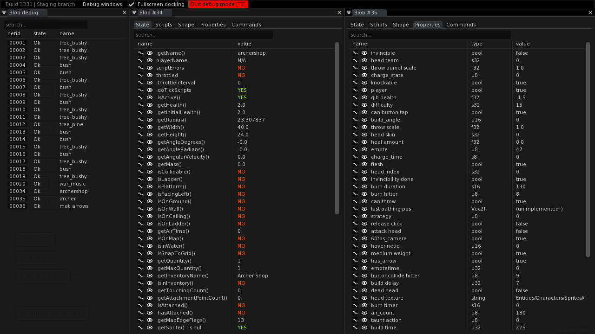

The blob list window (shown on the left) enumerates all existing blobs, with their network ID, state (`Ok`, `Thr***` for blobs throttled every N ticks or `Err` for blobs with errors) and blob name. Click on the netid button of a blob to open a debug window for that blob.

There are currently five tabs.

#### State

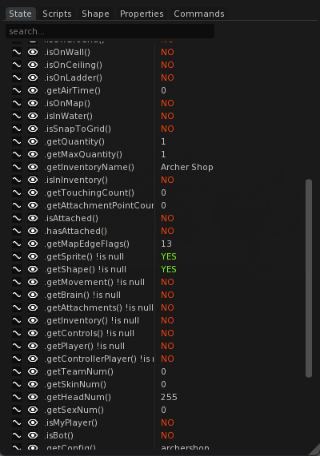

This enumerates some general states for a blob.

Each of these can be plotted or watched (this will be explained later on in this document). Note that due to the current stupid implementation, it is currently not possible to plot or watch properties while this tab is not selected.

#### Scripts

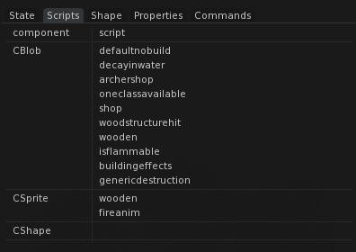

This enumerates, for each component, the scripts that are being used. Hover a script to get its full path.

#### Shape

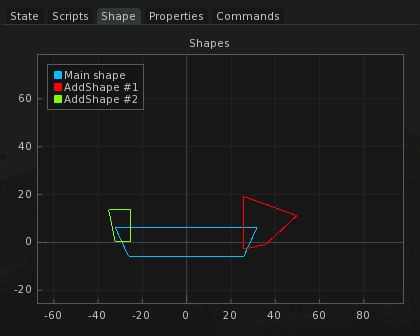

For custom vertex shape based blobs, this plots its different shapes. This is not the case for most blobs which use a circular shape and is not vertex-based.

#### Properties

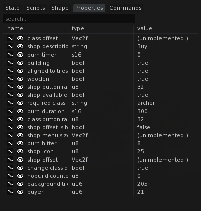

This enumerates all properties of a blob (set through the `.set_u8`, `.set_u16`, etc. methods), though currently only **non-generic** methods, i.e. not `.set` and `.get`, are supported.

Properties can be plotted or watched.

#### Commands

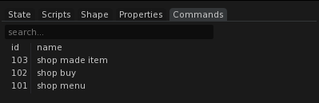

This enumerates commands registered with `CBlob::addCommandID`.

### Property plot

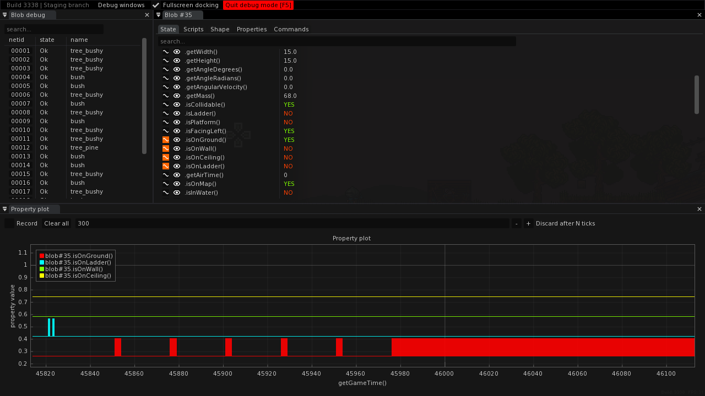

By ticking the "wave" button on any compatible property in the blob debug window, you can plot changes in a property depending on the current game time. This can be useful to track animation states and to debug subtle bugs, for instance.

Untick "record" in order to examine the data and to be able to scroll around and zoom in the plot.

Note that this is currently compatible only with a few types at the moment.

### Property monitor

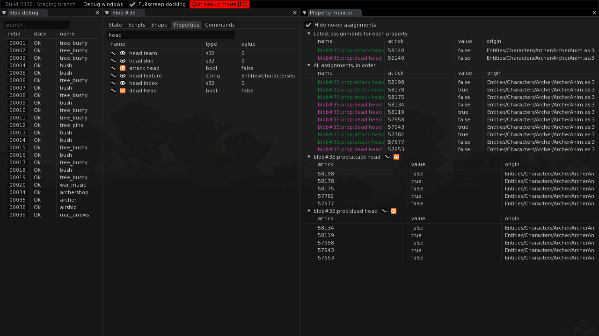

By ticking the "watch" button on any compatible property blob debug window, you can plot assignments or changes in a given property.

For properties in the "State" tab of the blob debug window, changes are logged every single tick, even if the value has not changed. Also, if the value has changed twice within a tick, only one change will end up being detected.

For properties in the "Properties" tab, *every* assignment is logged, in which case the origin script (if available) will be logged in the "origin" tab, and a detailed backtrace will be available if you hover the script name.

- The first collapsing tree, "Latest assignments for each property", shows the latest value assignment for every tracked property, including the tick during which the assignment occured and the origin of the assignment.
- The second collapsing tree, "All assignments, in order", will print every assignment of tracked properties in chronological order.
- The other collapsing trees show assignments in order for one tracked property.

You can tick the "hide no-op assignments" checkbox, in which case assignments which did not change the value of the property will be hidden (e.g. a blob property assigned twice in a row to `false`).

Note that this is currently compatible only with a few types at the moment.
