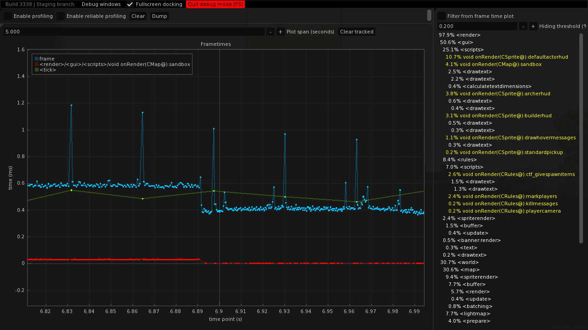

# Modding changes and improvements

## Removed behavior

### Lighting-related

- `Tile::light` is now unused by the engine, because the lightmap is held in a separate buffer. It was kept as to not break compatibility but mods relying on this field will misbehave.
- `CMap::getColorLight` is now only affected by map lighting and not by blob lights. This is due to how the lighting now works. If you required this behavior, you may need to emulate it.

## Deprecated behavior

Some behavior has been deprecated but kept functional in order to maintain compatibility with existing scripts.

Two `autoconfig.cfg` variables have been added:

- `g_allowdeprecated` (defaulting to `true`) allows deprecated behavior to function. If disabled, relying on deprecated behavior will cause an error, so the script may fail to compile or encounter an exception, whichever is relevant.
- `g_warndeprecated` (defaulting to `false`) will warn when relying on deprecated behavior. This is useful in order to identify and fix reliance on deprecated behavior in your mods.

Here is a list of the following deprecated behaviors.

### `.length()` calls

```angelscript
const int[] my_ints = {1, 2, 3};

const int len1 = my_ints.length(); // DEPRECATED!
const int len2 = my_ints.length; // OK
const int len3 = my_ints.size(); // OK
```

Use `.length` or `.size()` instead of `.length` (both are functionally equivalent).

The reason for this is that `.length` is already registered and used using [property accessors](https://www.angelcode.com/angelscript/sdk/docs/manual/doc_reg_objprop.html) when the latest AngelScript version does not allow to have a method and a proprety with the same name.

The workaround consists of replacing **any identified** `.length()` calls to `.size()`.  
This works for all tested mods, but this may cause issues should you be calling any `.length()` method on your script classes.

If `g_allowdeprecated` is set to **`false`**, this will skip the script preprocessing and will cause the script to fail to compile.

### Out-of-bounds array accesses

Certain array types would silently allow indexing outside of array boundaries, which could allow mods to read garbage data or cause hard crashes.

- If `g_allowdeprecated` is set to `true`, any out-of-bounds access will return the last element of the array, if present, or cause a script exception otherwise.
- If `g_allowdeprecated` is set to `false`, any out-of-bounds access will cause a script exception as it should.

## Updated AngelScript

AngelScript has been updated to a recent version. This brings among other things faster script compilation and new language features, including `auto`, `final`, anonymous functions, list initializers, among other things.

## AngelScript JIT

This is currently available on Linux only due to corruption issues on Windows.

[BlindMindStudio's JIT compiler](https://github.com/BlindMindStudios/AngelScript-JIT-Compiler) is now used which significantly improves script performance.

## Better script error logging

Script compile errors were reworked to be more readable and to provide context.


AngelScript prompt errors have been improved in a similar way:


Script execution traces were also improved:


## Blob tick throttling

A `CBlob::throttleInterval` field has been added, which allows to throttle blob ticking entirely. This is much more effective than just throttling scripts using `runFlags` because it skips much more processing (including `CSprite` ticking).

This may require some testing to see if it is worthwhile for your particular usecase, but this was found to improve performance without introducing significant side-effects when used properly.

Off-screen blob throttling can be implemented by adding the `OffscreenThrottle.as` script to blobs that you want to throttle (NOTE: see the `AsuMagic/kag-base:staging-all` branch).

## Script timeout detection

`g_timeoutscripts` has been improved to be less impactful on performance. While not perfectly reliable, this can be used to detect the source of infinite loops in your scripts.

## `CBitStream` read checking

`CBitStream` now checks for bad reads more aggressively. You should still always use `saferead_` methods when possible but this should help catching some programming errors.

## New keys

The `EKEY_CODE` enum has been extended with two new sets of keys:

- `MIDI_FIRST`..`MIDI_LAST`. If a key `x` is within that range, `x - MIDI_FIRST` is the MIDI key pitch.
- `MOUSE_EXTRA_FIRST`..`MOUSE_EXTRA_LAST`. If a key `x` is within that range, `x - MOUSE_EXTRA_FIRST` is the number of the extra mouse button. For instance, `MOUSE_EXTRA_FIRST` is the 1st extra button, `MOUSE_EXTRA_FIRST + 1` is the 2nd extra button, and so on.

`KEY_XBUTTON1` and `KEY_XBUTTON2` were remapped to `MOUSE_EXTRA_FIRST` and `MOUSE_EXTRA_FIRST + 1`, respectively. This means that their underlying value has changed, but this should not be a problem if you were not relying on such behavior (by e.g. serializing the button index between uncompatible versions).

Note that key names are properly implemented for these keys, so `CControls::getKeyName()` will return a human-readable name. In particular, for MIDI keys within the range of a piano, the traditional piano key names will be used (e.g. `"MIDI KEY C#5"`).

## (EXPERIMENTAL) dear imgui bindings

Various dear imgui functions now have a binding provided in the `ImGui` namespace. Refer to the scripting manual, as usual. API usage is mostly identical to C++ interface, so the official documentation and [imgui demo](https://github.com/ocornut/imgui/blob/master/imgui_demo.cpp) should be useful.

Simple example script:

```angelscript
void onRender(CRules@ this)
{
	if (ImGui::Begin("Blobs"))
	{
		CBlob@[] blobs;
		getBlobs(@blobs);

		for (int i = 0; i < blobs.size(); ++i)
		{
			ImGui::PushID(i);

			CBlob@ blob = @blobs[i];
			ImGui::Text(blob.getName());
			ImGui::SameLine();
			ImGui::TextDisabled("netid: " + blob.getNetworkID());
			ImGui::SameLine();
			if (ImGui::Button("kill"))
			{
				blob.server_Die();
			}

			ImGui::PopID();
		}
	}

	ImGui::End();
}
```

## (EXPERIMENTAL) New audio bindings

`Sound::play` and related functions now return a `Sound::Voice@` handle. This new class provides various methods to manage a sound by e.g. adding sound effects, changing the pitch dynamically.

Several audio filters were added:

```
Sound::Filter@ Sound::CreateBassboostFilter()
Sound::Filter@ Sound::CreateBiquadResonantFilter()
Sound::Filter@ Sound::CreateDCRemovalFilter()
Sound::Filter@ Sound::CreateEchoFilter()
Sound::Filter@ Sound::CreateFlangerFilter()
Sound::Filter@ Sound::CreateFreeverbFilter()
Sound::Filter@ Sound::CreateLofiFilter()
Sound::Filter@ Sound::CreateRobotizeFilter()
Sound::Filter@ Sound::CreateWaveShaperFilter()
```

You can set a sound filter to be used globally using `Sound::setGlobalFilter()` (e.g. you could set a freeverb global filter to be used when you are in a cave to simulate reverb acoustics).

Several audio sources were added:

```
Sound::Speech@ Sound::CreateSpeech(const string&in name)
void Sound::RebindSpeech(const string&in name, Sound::Speech@ speech)
Sound::Vizsn@ Sound::CreateVizsn(const string&in name)
void Sound::RebindVizsn(const string&in name, Sound::Vizsn@ vizsn)
Sound::Noise@ Sound::CreateNoise(const string&in name)
void Sound::RebindNoise(const string&in name, Sound::Noise@ vizsn)
```

Audio sources are created by binding them to a name. This name can then be used instead of the path to a sound file in order to play audio using said audio source.  
`Sound::Rebind*` methods bind an *existing* sound source to a name if this is something you want to do.

Refer to the SoLoud documentation for further explanation (most notably on filter parameters). Note that instead of free functions, most of voice handling functions are implemented as methods.

Here is an example of chat voice synthesis implemented using the new audio and dear imgui bindings:

```angelscript
bool use_vizsn = false;

namespace params
{

uint base_frequency = 1330;
float base_speed = 10.0f;
float base_declination = 5.0f;
int waveform = Sound::SpeechWaveform::TRIANGLE;

}

bool onClientProcessChat(CRules@ this, const string &in textIn, string &out textOut, CPlayer@ player)
{
	// Sound::Source@ source = @speech or @vizsn conditionally;
	Sound::Speech@ speech = null;
	Sound::Vizsn@ vizsn = null;

	if (use_vizsn)
	{
		@vizsn = Sound::CreateVizsn("chat");
		vizsn.setText(textIn.toLower());
	}
	else
	{
		@speech = Sound::CreateSpeech("chat");
		speech.setParams(params::base_frequency, params::base_speed, params::base_declination, params::waveform);
		speech.setText(textIn.toLower());
	}

	CBlob@ blob = player.getBlob();

	Sound::Voice@ voice;

	if (blob !is null)
	{
		@voice = Sound::Play("chat", blob.getPosition());
	}
	else
	{
		@voice = Sound::Play("chat");
	}

	voice.setVolume(10.0f);

	return true;
}

void onRender(CRules@ this)
{
	if (ImGui::Begin("Speech synth"))
	{
		if (!use_vizsn)
		{
			params::base_frequency = ImGui::SliderInt("Frequency", params::base_frequency, 100, 10000);
			params::base_speed = ImGui::SliderFloat("Speed", params::base_speed, 1.0f, 100.0f);
			params::base_declination = ImGui::SliderFloat("Declination", params::base_declination, 1.0f, 50.0f);
			params::waveform = ImGui::SliderInt("Waveform type", params::waveform, Sound::SpeechWaveform::SAW, Sound::SpeechWaveform::WARBLE);
		}
	}

	ImGui::End();
}
```

## Debug menu and new console

A new debug menu was added and can be brought up using F5, or the home key to open the console and focus on the text prompt.

The new console should be more intuitive to use and integrates with the new debug menu better.


This uses the [`docking`](https://github.com/ocornut/imgui/issues/2109) branch of [dear imgui](https://github.com/ocornut/imgui), so you can dock windows together by grabbing them by the title bar. You can make a window fullscreen by ticking "Fullscreen docking" in the menu bar on top and by dragging the window you want by the titlebar.

Note that some of the debug windows will only be available if you have admin rights on the server you are playing on.

### Note on plots

There are several uses of plots in the debug menu, so here are general tips on how to use these efficiently:

- You can move around the plot by keeping left click pressed and dragging the cursor around.
- You can scroll in the plot area in order to zoom on both axes, or you can scroll on an axis to zoom that particular one.  
- You can double left click on the plot area in order to fit all points in the graph.  
- You can double right click the plot in order to open a contextual menu useful to modify some plot rendering behavior.  
- You can temporarily hide a plot by clicking its square in the legend.

### Profiler

The existing profiler was greatly improved and made into a visual profiler, which integrates a frametime plot (using [implot](https://github.com/epezent/implot)). This provides a far better insight for performance analysis.



"Enable profiling" enables profiling regardless of whether the F5 menu is open, and "Enable reliable profiling" will enable profiling only when the F5 menu is closed, so that the debug menu rendering and profiling does not interfere (as much) with the performance statistics.

Note that at the moment, large plot spans will worsen performance with the profiler open significantly, which should get improved in the future.

You can hover tasks in the tree view on the right pane to get more information about a specific task. Clicking it will plot the time it took for every frame, which can be helpful to identify tasks that may cause stuttering or the impact of a task which takes a variable time to complete.  
Click "Clear tracked" in order to remove these plots.

Disable profiling when you want to examine the data in order to be able to zoom horizontally.

### Audio

Audio debug. This is only useful for debugging purposes.

### Physics

Physics debug. This shows timings for various Box2D steps along with other statistics useful to identify shape leaks which could cause memory leaks and performance degradation.

### (EXPERIMENTAL) Blobs


The blob list window (shown on the left) enumerates all existing blobs, with their network ID, state (`Ok`, `Thr***` for blobs throttled every N ticks or `Err` for blobs with errors) and blob name. Click on the netid button of a blob to open a debug window for that blob.

There are currently five tabs.

#### State


This enumerates some general states for a blob.

Each of these can be plotted or watched (this will be explained later on in this document). Note that due to the current stupid implementation, it is currently not possible to plot or watch properties while this tab is not selected.

#### Scripts


This enumerates, for each component, the scripts that are being used. Hover a script to get its full path.

#### Shape


For custom vertex shape based blobs, this plots its different shapes. This is not the case for most blobs which use a circular shape and is not vertex-based.

#### Properties


This enumerates all properties of a blob (set through the `.set_u8`, `.set_u16`, etc. methods), though currently only **non-generic** methods, i.e. not `.set` and `.get`, are supported.

Properties can be plotted or watched.

#### Commands


This enumerates commands registered with `CBlob::addCommandID`.

### Property plot


By ticking the "wave" button on any compatible property in the blob debug window, you can plot changes in a property depending on the current game time. This can be useful to track animation states and to debug subtle bugs, for instance.

Untick "record" in order to examine the data and to be able to scroll around and zoom in the plot.

Note that this is currently compatible only with a few types at the moment.

### Property monitor


By ticking the "watch" button on any compatible property blob debug window, you can plot assignments or changes in a given property.

For properties in the "State" tab of the blob debug window, changes are logged every single tick, even if the value has not changed. Also, if the value has changed twice within a tick, only one change will end up being detected.

For properties in the "Properties" tab, *every* assignment is logged, in which case the origin script (if available) will be logged in the "origin" tab, and a detailed backtrace will be available if you hover the script name.

- The first collapsing tree, "Latest assignments for each property", shows the latest value assignment for every tracked property, including the tick during which the assignment occured and the origin of the assignment.
- The second collapsing tree, "All assignments, in order", will print every assignment of tracked properties in chronological order.
- The other collapsing trees show assignments in order for one tracked property.

You can tick the "hide no-op assignments" checkbox, in which case assignments which did not change the value of the property will be hidden (e.g. a blob property assigned twice in a row to `false`).

Note that this is currently compatible only with a few types at the moment.